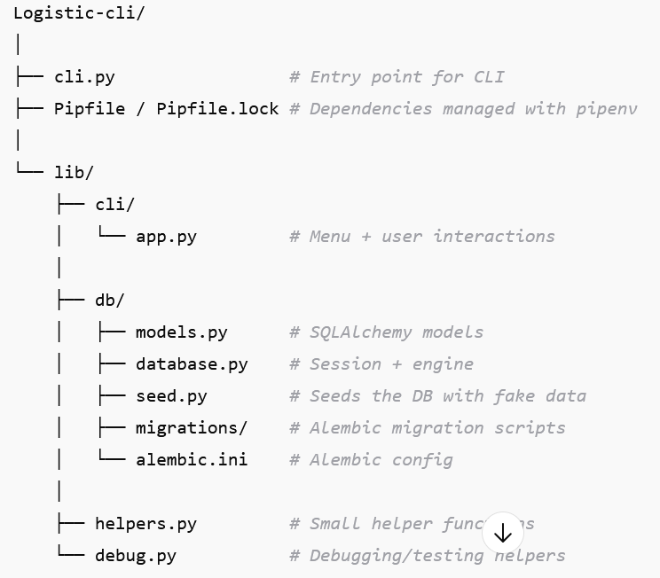
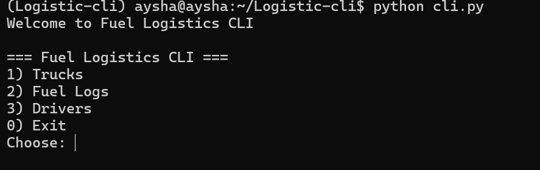
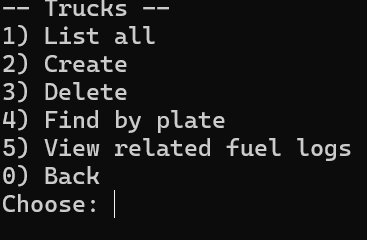
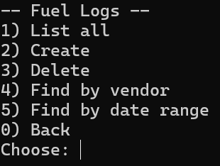
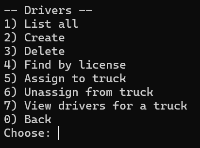

## LOGISTIC CLI.
This is a small command-line application I built to practice working with Python, SQLAlchemy ORM, and Alembic migrations. The project simulates a basic logistics system where I can manage trucks, drivers, and their fuel logs.

### The goal of this project was to learn:

1.How to design and organize a Python project with packages (lib/cli, lib/db)

2.How to model tables using SQLAlchemy and relationships (e.g. trucks ↔ drivers, trucks ↔ fuel logs)

3.How to use Alembic for database migrations

4.How to write CRUD operations (Create, Read, Update, Delete) for models

5.How to seed fake but realistic data using Faker

6.How to build a simple text-based CLI to interact with everything

### Features ✨

1.Trucks

  Add, list, update, delete

  Each truck has a plate number, capacity, and status

2.Drivers

  Add, list, update, delete

  Drivers can be linked to trucks

3.Fuel Logs

  Record fuel purchases with vendor, liters, price, location, odometer, and date

  Query logs by truck, vendor, or date range

4.Seed Data

  Populate the database with fake trucks, drivers, and fuel logs using Faker

  Useful for testing
  ## STRUCTURE
  

  
## SETUP
1.Clone the repo and install dependencies (using pipenv):
    pipenv install
    pipenv shell
2.Run migrations (creates the database schema):
    cd lib/db
    alembic upgrade head
3.Start the CLI:
     python cli.py

## Example Usage 🖥️

1.Trucks menu

  . Add a truck → enter plate, capacity, status

  . List all trucks → shows all with IDs

2.Drivers menu

  . Add driver → name, license, phone

  . Some drivers can be assigned to trucks

3.Fuel logs menu

  . Record fuel purchase

  . Query logs by date/vendor

### What I Learned 📚

1.How to split a project into clear modules (cli, db)

2.The importance of migrations instead of manually editing DBs

3.How to use mixins for reusable CRUD methods

4.How to seed fake data for testing (thanks to Faker)

5.How to debug imports and project structure in VSCode + WSL

### FUTURE ENHANCEMENT 🚀

-Add reports (e.g. fuel cost per truck, average consumption)

-Export logs to CSV

-Add authentication (stretch goal)

Here is what it looks like when i run the program;

## TRUCK MENU

## FUEL LOG MENU

## DRIVERS MENU

